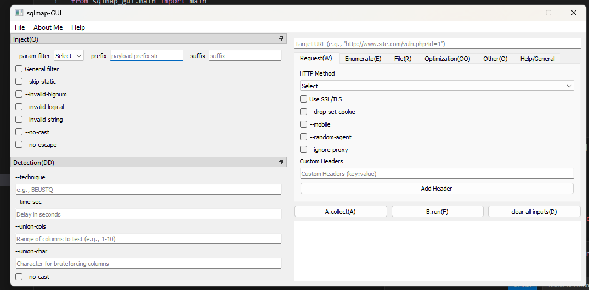
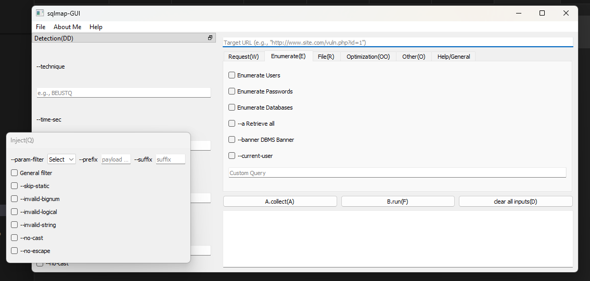

# sqlmap-gui


`sqlmap-gui` is a Python-based graphical user interface (GUI) for interacting with the powerful [sqlmap](https://github.com/sqlmapproject/sqlmap) penetration testing tool. This GUI simplifies the use of sqlmap, enabling users to execute SQL injection tests and analyze vulnerabilities without requiring extensive command-line experience.

---

[](#) [](#) [](#)


## Features

- **User-Friendly Interface**: Simplified navigation for sqlmap functionalities.
- **Comprehensive Options**: Access to all popular sqlmap commands with categorized tabs.
- **Results Display**: Real-time output display for executed sqlmap commands.
- **Cross-Platform**: Runs on Windows and ~~Linux~~ (working).
- **Customizable**: Easily add new features or extend the interface.

---

## Screenshots





---

## Installation

Follow these steps to set up the project locally:

### Clone the Repository

```bash
git clone https://github.com/raselmandol/sqlmap-gui.git
cd sqlmap-gui
```

### Create a Virtual Environment

```bash
python -m venv sqlmap_env
sqlmap_env\Scripts\activate    # Windows
```

### Install Dependencies

```bash
pip install -r requirements.txt
```

###  Build

```bash
pip install -e .
```
### Run the Application

```bash
python sqlmap_gui
```
---

##  Build Executable (Windows)

if you want to build an `.exe`:

### Install PyInstaller:
   ```bash
   pip install pyinstaller
   ```

> **Note:** Already added in `requirements.txt`. (If you want to ignore it, make sure to remove it from `requirements.txt`.)


Convert your PNG icon to ICO.

### Run:
   ```bash
   pyinstaller --name sqlmap-gui --onefile --windowed --icon=icon.ico sqlmap_gui/main.py
   ```

---

## Builder Script (`builder.bat`)
###  Usage
Run the script with one of the following flags:

```bash
builder.bat --build
```
Builds the project using `pip install -e .`.

```bash
builder.bat --run
```
Runs the main application:

```bash
python sqlmap_gui
```


```bash
builder.bat --exe
```
Builds a standalone executable using **PyInstaller**. Configuration parameters are loaded from `config.txt`.

---

## How to Use

 1. Launch the GUI (`python sqlmap_gui`).
 2. Navigate through the tabs to explore sqlmap commands:
   - **Injection Tests**: Enter a target URL and customize sqlmap options.
   - **Advanced Options**: Configure sqlmap payloads and settings.
 3. Execute the command and view results in the output console.

---


## Example

Here is a sample workflow for detecting vulnerabilities on a target website:

1. Enter the target URL: `http://example.com/page?id=1`.
2. Select detection options like:
   - **Technique**: `--technique=T`
   - **DBMS**: `--dbms=mysql`
3. Click `Run` to execute sqlmap.
4. View results in the output console.

---

## More

To get a list of basic options and switches use:

```bash
-h
```
To get a list of all options and switches use:
```bash
-hh
```

To get an overview of sqlmap capabilities, a list of supported features, and a description of all options and switches, along with examples, you are advised to consult the [user's manual](https://github.com/sqlmapproject/sqlmap/wiki/Usage). Use extra/optional command input option to use those extra options and switches. You can find Custom Query option in Enumerate tab.

---

## Requirements

- Python 3.8+
- PyQt5
- [sqlmap](https://github.com/sqlmapproject/sqlmap) source

---

## Contribution

Contributions are welcome! To contribute:

1. Fork this repository.
2. Create a new branch:

   ```bash
   git checkout -b feature-name
   ```

3. Commit your changes:

   ```bash
   git commit -m "Add new feature"
   ```

4. Push to your branch:

   ```bash
   git push origin feature-name
   ```

5. Open a pull request.

---

## License

This project is licensed under the MIT License, [sqlmap license](https://raw.githubusercontent.com/sqlmapproject/sqlmap/refs/heads/master/LICENSE).
---

## To-Do


- [ ]  Enhance error handling.
- [ ]  Builder.bat script
- [ ]  Option to load Sqlmap source/folder selection
- [ ]  Improve documentation with more examples.
- [ ]  More tabs/ more options
- [ ]  Background Process
- [ ]  JSON import, export
- [ ]  History Tab
- [ ]  Optimization tab
- [ ]  WebScarab proxy
- [ ]  Burp proxy
- [ ]  sqlmap web
- [ ]  Clean terminal/editor  
- [ ]  GitHub pages with documentation